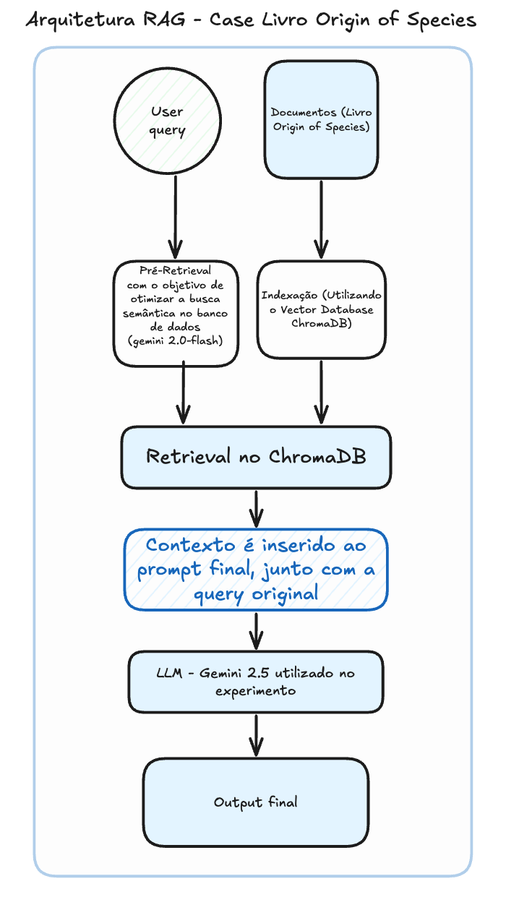
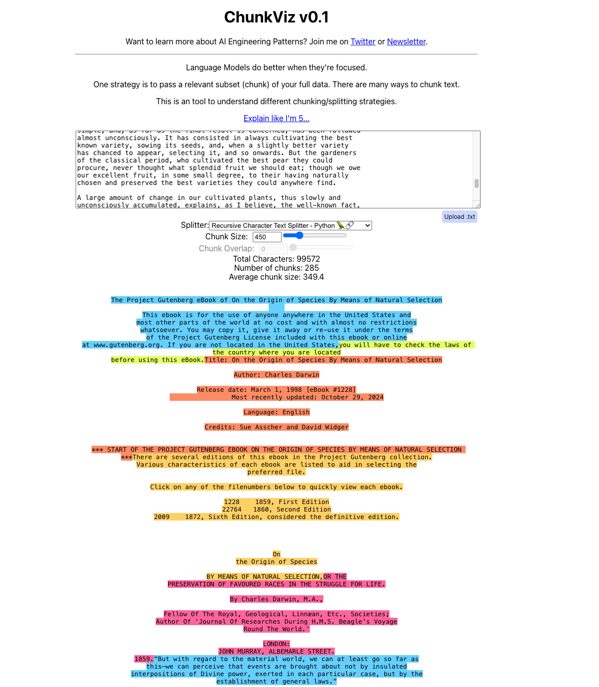

# Case de IA Generativa com RAG (Retrieval-Augmented Generation)

A ideia deste case é desenvolver uma aplicação RAG para responder questões precisas e contextualizadas baseadas no livro `A Origem das Espécies`

Este projeto utiliza a biblioteca `streamlit` que facilita a criação de uma interface de chat com scripts python customizados. Para o caso de uma aplicação real, provavelmente outra abordagem seria selecionada como o desenvolvimento de uma API em python com um frontend separado ou permitindo múltiplos frontends chamarem a mesma.

## Dependências técnicas

* `Python` versão 3.12
* `Poetry` para gerenciamento de dependências. Instalação [neste link](https://python-poetry.org/docs/#installation)
* `streamlit` para gerar de maneira simples uma interface de chat provisória
* `ruff` para linting de código
* `langchain` para utilização de LLMs
* `chromadb` para banco de dados de vetor


## Ambiente

Foi escolhido o `Poetry` para o gerenciamento do ambiente também, mas o `pyenv` pode ser utilizado também. A versão do python recomendada é a `3.12` ou superior.

Você pode ativar a versão necessária para este projeto com o comando:

```bash
poetry env use 3.12
```

Mais informações sobre ambientes do poetry podem ser encontradas [neste link](https://python-poetry.org/docs/managing-environments/)

## Comandos essenciais

No arquivo `pyproject.toml`, temos definidos alguns scripts para rodar a aplicação, contando com scripts para linting, build e execução.

1. Linting

```bash
poetry run poe lint
poetry run poe lint-fix
```

2. Build

```bash
poetry build
```

3. Rodar o projeto

```bash
poetry run streamlit run src/origin_of_species_rag/main.py
```

O programa irá servir um servidor do streamlit em `http://localhost:8501`

## Arquitetura

### Fluxo do projeto

O fluxo do projeto consiste em um RAG que utiliza um banco de dados de vetores para salvar chunks dos dados do livro Origin of Species. 

1. O primeiro passo é a transformação do livro em chunks para serem salvos no banco de dados.

2. Na utilização da aplicação, o usuário irá enviar uma query. Essa query passará pelo primeiro modelo LLM de "pré-retrieval", que irá tentar encontrar termos e possíveis respostas que irão ampliar as chances da resposta correta ser encontrada no retrieval.

3. A busca semântica é realizada no ChromaDB com base no output do processo `2` e 2 chunks são selecionados para a query original, além de mais 2 para cada termo similar retornado no passo anterior.

4. No passo 4, o contexto é inserido ao prompt final junto com a query original

5. O prompt é passado novamente para uma LLM, que irá responder a query original com as informações obtidas

6. Output final e o usuário pode mandar uma nova mensagem ao chat.

</img>

### Arquivos

*   `src`: Contém o código-fonte principal da aplicação, organizado em subdiretórios como `core`, `models`, `utils` e o ponto de entrada `origin_of_species_rag`.
    * `core`: Possui os arquivos para conexão com a vector_store; de extração de chunks e embeddings; os prompts utilizados; e por fim, o código de configuração do streamlit
    * `models`: Possui o código dos agentes utilizados no processo
    * `origin_of_species_rag`: Possui o código do `rag_runner`, responsável por rodar o projeto, e é o ponto de partida do projeto na `main.py`.
*   `data`: Armazena os dados brutos utilizados pela aplicação, como o arquivo de texto do livro (`the_origin_of_species.txt`).
*   `chroma_db`: Guarda os arquivos do banco de dados vetorial ChromaDB, incluindo o banco de dados SQLite (`chroma.sqlite3`) e os arquivos de índice/vetor.

## Embeddings

Para este projeto, foi utilizado o RecursiveCharacterEmbeddings, com chunk size de 450 tokens. Foi utilizado este valor pois conforme visualizado pela ferramenta chunkviz, percebe-se uma boa separação das sentenças com um método relativamente simples.

</img>

Os embeddings foram gerados uma única vez e salvos em uma instância local do chromaDB, que não é versionada pelo git.

## Melhorias Futuras

* Utilizar ChromaDB HttpClient, para conectar a um banco rodando em um container ou algo similar
* Melhorar os embeddings
* Permitir pelos metadados adicionar mais livros para a base de conhecimento
* Migrar do langchain_google_genai para langchain_google_vertexai que permite limites maiores para aplicações comerciais
* Testes automatizados do código
* Testes automatizados de qualidade do RAG com a utilização de LLMs para rankeamento.